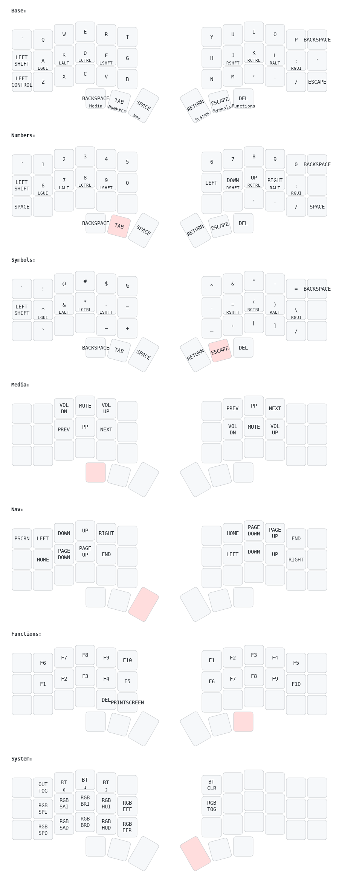

# Corne Layout
Trial layout for getting used with 5 columns crkbd.
For now I'm not changing away from QWERTY, however this is an idea.

[Layout view link](https://keymap-drawer.streamlit.app/?zmk_url=https%3A%2F%2Fgithub.com%2Fadmilsonmarques%2Fzmk-config%2Fblob%2Fmain%2Fconfig%2Fcorne.keymap)

